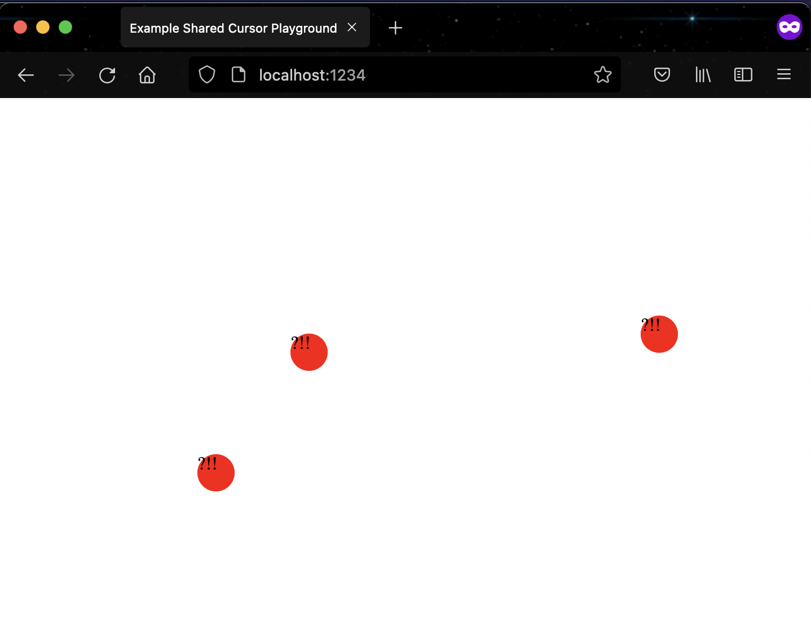

# firebase-cursor-server aka cursorparty

set of react hooks that integrates with firebase
usable for cursor parties

can use a generic realtime backend (firebase is just the only impl'd one right now)

see example for more

tech used in https://punks.house/

run example: 
`sh example/run.sh`

example preview:

